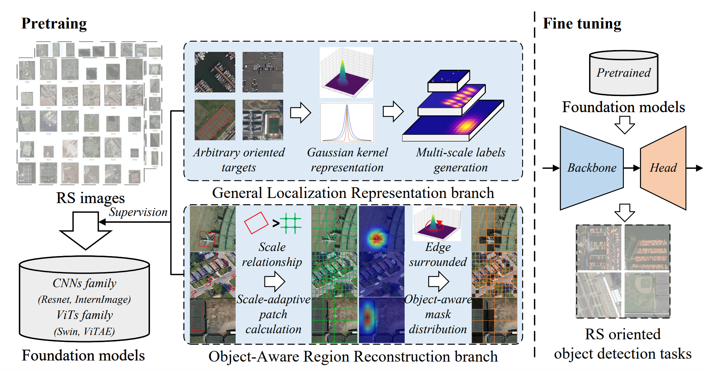

## The offical PyTorch code for paper 
[""Bridging the Task-domain Gap in Pre-training Remote Sensing Object Detectors"", TCSVT 2026.](https://ieeexplore.ieee.org/document/11701310)

##### Author: Zicong Zhu


<a href="https://pypi.org/project/mitype/"></a>

```bash
#### News:
#### 2025.11.20: The paper is published on IEEE TGRS!
#### 2025.12.05: code of ACDet is open source!
```

## INTRODUCTION

We proposes LOBA, a pre-training method specifically designed for remote sensing oriented object detection that combines a General Localization Representation (GLR) branch, which converts oriented bounding boxes into adaptive multi-scale Gaussian kernel representations for general localization learning, with an Object-aware Region Reconstruction (ORR) branch, which adaptively controls masked regions based on target geometric characteristics, thereby achieving state-of-the-art transfer performance with less data.

##
## LOBA
### Pretraining framework

<div align="center">
  
</div>

The working pipeline of our LOBA. It consists of two branches, GLR and ORR, both in the pre-training phase. They provide the model with
supervision for object localization and perception, effectively eliminating the task-domain bias between pre-training and fine-tuning.

### Installation

```shell
CUDA >= 9.2
GCC >= 5
Python == 3.8
PyTorch == 1.13.0
mmcv-full
mmdet
mmrotate
```

### weights

the pretrained weights can be found here.

- [Swin-Tiny-LOBA](https://pan.baidu.com/s/1-LfDNSRMQxCxBXyxsqmvKQ?pwd=btgb)

### training, testing, and inferencing

follow the official mmrotate framework to train and test ACDet. 

## Citation
If you feel this code helpful or use this code or dataset, please cite it as
```

@ARTICLE{11701310,
  author={Zhu, Zicong and Ni, Jingen and Kang, Jian and Feng, Yingchao and Li, Junxi},
  journal={IEEE Transactions on Circuits and Systems for Video Technology}, 
  title={Bridging the Task-domain Gap in Pre-training Remote Sensing Object Detectors}, 
  year={2026},
  volume={},
  number={},
  pages={1-1},
  keywords={Modeling;Training;Learning (artificial intelligence);Remote sensing;Tuning;Location awareness;Algorithms;Distance measurement;Object detection;Visualization;Remote sensing;Image pretrain;Oriented object detection;General localization;Object-aware reconstruction},
  doi={10.1109/TCSVT.2026.3735572}
}

```
